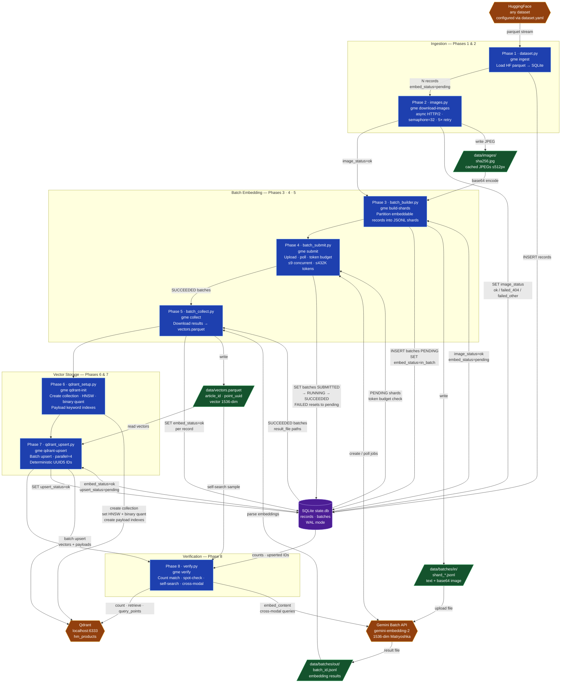

# Gemini Multimodal Embeddings Pipeline
ETL pipeline that generates embeddings for **any HuggingFace dataset** using the **Gemini Embedding 2** model via the **Gemini Batch API**, then stores them in **Qdrant** for vector search. Supports **text, image, and multimodal (text + image)** embedding modes. Ships with the H&M fashion products dataset as the default example.


## Overview

```
HuggingFace Dataset          Gemini Batch API             Qdrant (local)
  any HF dataset         →   gemini-embedding-2    →    configurable collection
  configured via              text | image | both         1536-dim COSINE vectors
  dataset.yaml               1536-dim Matryoshka          + metadata payload

  Default: Qdrant/hm_ecommerce_products (~105K products)
```

The pipeline is driven by `dataset.yaml` and works with any HuggingFace dataset. `gme inspect` auto-generates a starter config from any HF dataset schema.

### Modality Support

The pipeline supports three embedding modalities, configured via the `modality` field in `dataset.yaml` or the `--modality` flag during ingestion:

| Modality | Description | Required Fields |
|---|---|---|
| `text` | Embeds only text content. | `text_template` |
| `image` | Embeds only the image. | `image_column` |
| `multimodal` | (Default) Jointly embeds text and image into a single vector. | `text_template`, `image_column` |

This flexibility allows you to use the same pipeline for pure text search, pure image search (reverse image search), or sophisticated multimodal search.

It is built around the Gemini Batch API (50% cost discount vs. synchronous calls) and enforces Tier 1 rate limits at 90%:

| Limit | Tier 1 | This pipeline |
|---|---|---|
| Batch enqueued tokens (Embedding) | 500,000 | ≤ 432,000 |
| Concurrent batch jobs | 100 | ≤ 9 (with 100 records/shard ≈ 33K tokens/shard) |

## Cost Estimation

> **Note:** Gemini Embedding 2 has no published batch pricing. Batch pricing is generally 50% of the standard rate, so the figures below are approximate estimates based on that assumption. See the [official pricing page](https://ai.google.dev/gemini-api/docs/pricing#gemini-embedding-2) for current standard rates.

**Standard unit cost per record** (1 image + ~50 text tokens):

| Input | Calculation | Cost |
|---|---|---|
| Text (~50 tokens) | 50 × ($0.20 / 1,000,000) | $0.00001 |
| Image (1 piece) | — | $0.00012 |
| **Total (standard)** | | **$0.00013** |

**Batch unit cost** (estimated ~50% discount): **$0.000065 per record**

**Total cost at scale (batch)**:

| Records | Estimated Cost (USD) |
|---|---|
| 1,000 | $0.065 |
| 10,000 | $0.65 |
| 100,000 | $6.50 |
| 1,000,000 | $65.00 |

For the included H&M example dataset (~105K records), the estimated batch cost is **$6.80**.

### Architecture



## Dataset

The pipeline works with **any HuggingFace dataset** that has text and/or image columns. Configuration lives in `dataset.yaml` — run `gme inspect --dataset <org/name> --generate-config` to auto-generate a starter config for any HF dataset, then edit as needed.

The repo ships with [Qdrant/hm_ecommerce_products](https://huggingface.co/datasets/Qdrant/hm_ecommerce_products) as the default example — 105,000 H&M product rows with:
- `text_to_embed` — concatenated product attributes (name, type, color, description)
- `image_url` — S3-hosted product image

Precomputed embedding columns (`dense_embedding`, `sparse_indices`, `sparse_values`) are excluded via `payload.exclude`. All other columns (including `image_url`) are stored as Qdrant payload.

## Requirements

- Python 3.11+
- [uv](https://docs.astral.sh/uv/) for environment management
- Docker (for local Qdrant)
- A [Gemini API key](https://aistudio.google.com/app/apikey) with Tier 1 billing

## Setup

```bash
# 1. Clone and enter repo
git clone <repo-url>
cd gemini-multimodal-embeddings

# 2. Install dependencies
uv sync

# 3. Configure environment
cp .env.example .env
# Edit .env and set GEMINI_API_KEY

# 4. Start local Qdrant
docker compose up -d

# 5. Point at your dataset (or keep the default H&M example)
uv run gme inspect --dataset <org/name> --generate-config
# Edit dataset.yaml as needed, then proceed with gme ingest
```

## Running the Pipeline

Each phase is independently runnable and fully **idempotent/resumable** — interrupted runs pick up where they left off.

### Pilot run (recommended first)

Test end-to-end with 500 records before committing to the full dataset:

```bash
make pilot
# or step by step:
uv run gme ingest --limit 500
uv run gme download-images
uv run gme build-shards
uv run gme submit        # blocks until all batches complete
uv run gme collect
uv run gme qdrant-init
uv run gme qdrant-upsert
uv run gme verify
```

Inspect the result files under `data/batches/out/` after the first few shards and tune `RECORDS_PER_SHARD` in `.env` based on actual token usage.

### Full run

```bash
make full
# or:
uv run gme ingest        # no --limit flag
uv run gme download-images
uv run gme build-shards
uv run gme submit
uv run gme collect
uv run gme qdrant-init
uv run gme qdrant-upsert
uv run gme verify
```

### Check progress anytime

```bash
uv run gme status
```

## Example Execution

Below is a typical end-to-end run for a subset of the dataset:

```bash
$ uv run gme ingest --limit 2000
Loading dataset 'Qdrant/hm_ecommerce_products' (train split)…
Ingest complete. 2000 rows processed, 2000 new records inserted.

$ uv run gme download-images
Downloading 2000 images (concurrency=32)…
Image download complete. ok=1982, failed_404=0, failed_other=18

$ uv run gme build-shards
Building shards for 1982 records (shard_size=40)…
Built 50 shards in data/batches/in

$ uv run gme submit
[14:12:58] Submitted shard 0 → batch 79dxxx... (~13,200 tokens)
[14:13:02] Submitted shard 1 → batch 1l4rxx... (~13,200 tokens)
...
[14:18:15] Batch 79dxxx... → SUCCEEDED
[14:18:16] Batch 1l4rxx... → SUCCEEDED
...
All shards submitted and completed.

$ uv run gme collect
Collecting 50 completed batch(es)…
Collect complete. Vectors written: 1982, failures: 0
vectors.parquet total rows: 1982

$ uv run gme qdrant-init
Collection 'hm_products' created (dim=1536, COSINE, on-disk, binary quantization).

$ uv run gme qdrant-upsert
Loading vectors from parquet…
Loaded 1982 vectors.
Upserting 1982 points to 'hm_products'…
Upsert complete.

$ uv run gme verify
                     Verification Checks                      
┏━━━━━━━━━━━━━━━━━━━━━━━━━━┳━━━━━━━━━━━━━━━━━━━━━━━━━━━━━━━━━┓
┃ Check                    ┃ Result                          ┃
┡━━━━━━━━━━━━━━━━━━━━━━━━━━╇━━━━━━━━━━━━━━━━━━━━━━━━━━━━━━━━━┩
│ Count match              │ PASS (DB=1982, Qdrant=1982)     │
├──────────────────────────┼─────────────────────────────────┤
│ Spot-check 100           │ PASS (100/100 found)            │
├──────────────────────────┼─────────────────────────────────┤
│ Self-search (top-1=self) │ PASS (20/20)                    │
├──────────────────────────┼─────────────────────────────────┤
│ Cross-modal sanity       │ PASS (5/5 matched product_type) │
└──────────────────────────┴─────────────────────────────────┘

$ uv run gme cleanup
Shards (data/batches/in):
  50 of 50 shards fully embedded — eligible for deletion (57.3 MB)
Results (data/batches/out):
  50 of 50 result files fully upserted — eligible for deletion (37.2 MB)

Total reclaimable: 94.5 MB
Deleted 100 files, reclaimed 94.5 MB.
```

### Clean up intermediates

After a successful run, shard files (`data/batches/in/`) and result files (`data/batches/out/`) are no longer needed. Preview what's safe to delete, then reclaim the space:

```bash
uv run gme cleanup --dry-run              # preview: shows file counts and sizes
uv run gme cleanup                        # delete shards, results, and images (default --scope all)
uv run gme cleanup --scope shards         # delete only shard + result files
uv run gme cleanup --scope images         # delete only cached images
# or:
make cleanup
```

The command queries `state.db` to determine eligibility — only files whose records are fully embedded and upserted are deleted. `state.db` and `vectors.parquet` are never touched. Use `--scope shards` to preserve the image cache.

## Batch Management

Three commands let you inspect and recover from Gemini batch job issues without touching `state.db` manually.

| Command | Description |
|---|---|
| `gme batch-jobs [-n N]` | List the N most recent batch jobs from the Gemini API (default: 20) |
| `gme batch-cancel <batch_id>` | Cancel an active job; its records are reset to `pending` for re-sharding |
| `gme batch-delete <batch_id>` | Delete a completed or failed job; its records are reset to `pending` for re-sharding |

Both `batch-cancel` and `batch-delete` prompt for confirmation unless `--yes / -y` is passed. The `batch_id` argument is the full job name returned by `batch-jobs` (e.g. `batches/123456`).

## Pipeline Phases

| Command | Phase | Description |
|---|---|---|
| `gme inspect --dataset <name> [--generate-config]` | — | Print HF dataset schema; optionally scaffold `dataset.yaml` |
| `gme ingest` | 1 | Load HF dataset → SQLite state DB (driven by `dataset.yaml`) |
| `gme download-images` | 2 | Download + cache images as JPEG ≤512px |
| `gme build-shards` | 3 | Partition records into JSONL batch files |
| `gme submit` | 4 | Upload shards to Gemini, poll to completion |
| `gme collect` | 5 | Download results → `vectors.parquet` |
| `gme qdrant-init` | 6 | Create Qdrant collection + payload indexes (from `dataset.yaml`) |
| `gme qdrant-upsert` | 7 | Upsert vectors + payloads into Qdrant |
| `gme verify` | 8 | Count match, spot-check, self-search sanity |
| `gme cleanup [--scope all\|shards\|images] [--dry-run]` | — | Delete intermediate files by scope; default (`all`) deletes shards, results, and images |
| `gme batch-jobs [-n N]` | — | List recent Gemini batch jobs (default: 20) |
| `gme batch-cancel <batch_id> [-y]` | — | Cancel an active batch job; reset records for re-processing |
| `gme batch-delete <batch_id> [-y]` | — | Delete a batch job; reset records for re-processing |

## Configuration

### `dataset.yaml` — dataset mapping

| Field | Description |
|---|---|
| `dataset` | HuggingFace dataset name (e.g. `Qdrant/hm_ecommerce_products`) |
| `split` | Dataset split (default `train`) |
| `id_column` | Column to use as the unique record ID (becomes point UUID seed) |
| `text_template` | Python format string for text embedding (e.g. `"{title} {body}"`) |
| `image_column` | Column containing image URLs (string) or PIL images |
| `modality` | `text`, `image`, or `multimodal` |
| `payload.include` | Explicit whitelist of columns to store in Qdrant (default: all except excluded) |
| `payload.exclude` | Columns to drop from payload (e.g. precomputed embeddings) |
| `payload.indexes` | Columns to index in Qdrant as `keyword` for fast filtering |

Run `gme inspect --dataset <name> --generate-config` to generate a starter `dataset.yaml`.

### `.env` — runtime tuning

| Variable | Default | Description |
|---|---|---|
| `GEMINI_API_KEY` | — | Required |
| `QDRANT_URL` | `http://localhost:6333` | Qdrant endpoint |
| `QDRANT_COLLECTION` | `hm_products` | Collection name |
| `EMBEDDING_DIM` | `1536` | Matryoshka output dim (128–3072) |
| `RECORDS_PER_SHARD` | `100` | Records per batch job (~330 tokens/record: 258 image + ~70 text) |
| `MAX_CONCURRENT_JOBS` | `9` | Concurrent Gemini batch jobs |
| `MAX_ENQUEUED_TOKENS` | `432000` | Token cap across in-flight jobs (90% of 500K) |
| `IMAGE_DOWNLOAD_CONCURRENCY` | `32` | Parallel image downloads |
| `IMAGE_MAX_SIDE_PX` | `512` | Image resize cap before embedding (512px reduces Gemini image token cost) |

## Qdrant Collection Schema

- **Vectors**: 1536-dim, COSINE distance, on-disk HNSW (`m=16`, `ef_construct=128`)
- **Quantization**: Binary quantization (`always_ram=True`) — reduces index memory ~32× vs. float32
- **Payload**: all columns except `id_column` (becomes point UUID) and any explicit `payload.exclude`. `image_column` and text-template columns are kept as useful search-result metadata
- **Payload indexes**: defined in `dataset.yaml` under `payload.indexes`. The included H&M example configures KEYWORD indexes on `article_id`, `product_type_name`, `product_group_name`, `colour_group_name`, `perceived_colour_master_name`, `index_group_name`, `garment_group_name`, `department_name`, `section_name`

### Point Example from Qdrant Collection


## Project Structure

```
dataset.yaml         # dataset mapping config (id / text / image / payload columns)
src/gme/
  adapters.py        # DatasetConfig, HuggingFaceAdapter, NormalizedRecord, gme inspect
  config.py          # pydantic-settings (env-driven)
  state.py           # SQLite WAL state store
  dataset.py         # phase 1: ingest (thin wrapper over HuggingFaceAdapter)
  images.py          # phase 2: image download
  batch_builder.py   # phase 3: JSONL shard builder (modality-aware)
  batch_submit.py    # phase 4: Gemini Batch submit + poll daemon
  batch_collect.py   # phase 5: result collection → parquet
  qdrant_setup.py    # phase 6: collection + index creation
  qdrant_upsert.py   # phase 7: vector upsert
  verify.py          # phase 8: end-to-end verification
  cleanup.py         # intermediate file cleanup (shards + results)
  cli.py             # Typer CLI entry point
data/
  state.db           # SQLite pipeline state
  images/            # cached JPEGs (sha256-named)
  batches/in/        # JSONL request shards
  batches/out/       # downloaded result files
  vectors.parquet    # collected id→vector table
```

## Error Handling

- **404 images**: permanently skipped, counted in verify report
- **Transient download failures**: retried 5× with exponential backoff
- **Failed/expired batch jobs**: member records reset to `pending`, re-sharded on next `build-shards` run (max 3 attempts per record)
- **Per-record failures within a succeeded batch**: individually marked failed; siblings unaffected
- **Two parallel state spaces**: per-record `embed_status` (`pending → in_batch → ok/failed`) and per-batch-job lifecycle (`PENDING → SUBMITTED → RUNNING → SUCCEEDED/FAILED/EXPIRED`); a succeeded batch can still contain per-record errors — phase 5 reconciles both
- **Qdrant upsert**: retried 3× via client; deterministic UUID5 IDs make re-runs safe

## Development

```bash
make lint    # ruff check + format check
```

## Big Thanks To
❤️ Claude Code, Gemini CLI, Antigravity and GPT-Image 2.0 
