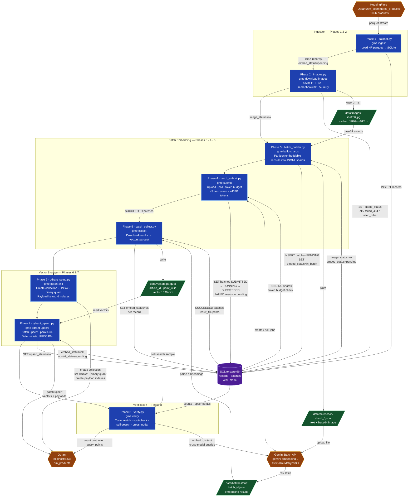

# Gemini Multimodal Embeddings Pipeline
ETL pipeline that generates multimodal (text + image) embeddings for H&M fashion products using the **Gemini Embedding 2** model via the **Gemini Batch API**, then stores them in **Qdrant** for vector search.


## Overview

```
HuggingFace Dataset          Gemini Batch API             Qdrant (local)
  Qdrant/hm_ecommerce    →   gemini-embedding-2    →    hm_products collection
  ~105,000 products          text + image (base64)       1536-dim COSINE vectors
                             1536-dim Matryoshka          + metadata payload
```

The pipeline is built around the Gemini Batch API (50% cost discount vs. synchronous calls) and enforces Tier 1 rate limits at 90%:

| Limit | Tier 1 | This pipeline |
|---|---|---|
| Batch enqueued tokens (Embedding) | 500,000 | ≤ 450,000 |
| Concurrent batch jobs | 100 | ≤ 9 (with 40 records/shard ≈ 48K tokens/shard) |

### Architecture



## Dataset

[Qdrant/hm_ecommerce_products](https://huggingface.co/datasets/Qdrant/hm_ecommerce_products) — 105,000 H&M product rows with:
- `text_to_embed` — concatenated product attributes (name, type, color, description)
- `image_url` — S3-hosted product image

Precomputed embedding columns (`dense_embedding`, `sparse_indices`, `sparse_values`) are dropped. All other columns are stored as Qdrant payload.

## Requirements

- Python 3.11+
- [uv](https://docs.astral.sh/uv/) for environment management
- Docker (for local Qdrant)
- A [Gemini API key](https://aistudio.google.com/app/apikey) with Tier 1 billing

## Setup

```bash
# 1. Clone and enter repo
git clone <repo-url>
cd gemini-multimodal-embeddings

# 2. Install dependencies
uv sync

# 3. Configure environment
cp .env.example .env
# Edit .env and set GEMINI_API_KEY

# 4. Start local Qdrant
docker compose up -d
```

## Running the Pipeline

Each phase is independently runnable and fully **idempotent/resumable** — interrupted runs pick up where they left off.

### Pilot run (recommended first)

Test end-to-end with 500 records before committing to the full 105K:

```bash
make pilot
# or step by step:
uv run gme ingest --limit 500
uv run gme download-images
uv run gme build-shards
uv run gme submit        # blocks until all batches complete
uv run gme collect
uv run gme qdrant-init
uv run gme qdrant-upsert
uv run gme verify
```

Inspect the result files under `data/batches/out/` after the first few shards and tune `RECORDS_PER_SHARD` in `.env` based on actual token usage.

### Full run

```bash
make full
# or:
uv run gme ingest        # no --limit flag
uv run gme download-images
uv run gme build-shards
uv run gme submit
uv run gme collect
uv run gme qdrant-init
uv run gme qdrant-upsert
uv run gme verify
```

### Check progress anytime

```bash
uv run gme status
```

## Pipeline Phases

| Command | Phase | Description |
|---|---|---|
| `gme ingest` | 1 | Load HF parquet → SQLite state DB |
| `gme download-images` | 2 | Download + cache images as JPEG ≤1024px |
| `gme build-shards` | 3 | Partition records into JSONL batch files |
| `gme submit` | 4 | Upload shards to Gemini, poll to completion |
| `gme collect` | 5 | Download results → `vectors.parquet` |
| `gme qdrant-init` | 6 | Create Qdrant collection + payload indexes |
| `gme qdrant-upsert` | 7 | Upsert vectors + payloads into Qdrant |
| `gme verify` | 8 | Count match, spot-check, self-search sanity |

## Configuration

All tunable via `.env`:

| Variable | Default | Description |
|---|---|---|
| `GEMINI_API_KEY` | — | Required |
| `QDRANT_URL` | `http://localhost:6333` | Qdrant endpoint |
| `QDRANT_COLLECTION` | `hm_products` | Collection name |
| `EMBEDDING_DIM` | `1536` | Matryoshka output dim (128–3072) |
| `RECORDS_PER_SHARD` | `100` | Records per batch job (~330 tokens/record: 259 image + ~70 text) |
| `MAX_CONCURRENT_JOBS` | `9` | Concurrent Gemini batch jobs |
| `MAX_ENQUEUED_TOKENS` | `432000` | Token cap across in-flight jobs (90% of 500K) |
| `IMAGE_DOWNLOAD_CONCURRENCY` | `32` | Parallel image downloads |
| `IMAGE_MAX_SIDE_PX` | `512` | Image resize cap before embedding (512px reduces Gemini image token cost) |

## Qdrant Collection Schema

- **Vectors**: 1536-dim, COSINE distance, on-disk HNSW (`m=16`, `ef_construct=128`)
- **Quantization**: Binary quantization (`always_ram=True`) — reduces index memory ~32× vs. float32
- **Payload**: all dataset metadata columns except precomputed embeddings
- **Payload indexes (KEYWORD)**: `product_type_name`, `product_group_name`, `colour_group_name`, `perceived_colour_master_name`, `index_group_name`, `garment_group_name`, `department_name`, `section_name`, `article_id`

## Project Structure

```
src/gme/
  config.py          # pydantic-settings (env-driven)
  state.py           # SQLite WAL state store
  dataset.py         # phase 1: ingest
  images.py          # phase 2: image download
  batch_builder.py   # phase 3: JSONL shard builder
  batch_submit.py    # phase 4: Gemini Batch submit + poll daemon
  batch_collect.py   # phase 5: result collection → parquet
  qdrant_setup.py    # phase 6: collection + index creation
  qdrant_upsert.py   # phase 7: vector upsert
  verify.py          # phase 8: end-to-end verification
  cli.py             # Typer CLI entry point
data/
  state.db           # SQLite pipeline state
  images/            # cached JPEGs (sha256-named)
  batches/in/        # JSONL request shards
  batches/out/       # downloaded result files
  vectors.parquet    # collected id→vector table
```

## Error Handling

- **404 images**: permanently skipped, counted in verify report
- **Transient download failures**: retried 5× with exponential backoff
- **Failed/expired batch jobs**: member records reset to `pending`, re-sharded on next `build-shards` run (max 3 attempts per record)
- **Per-record failures within a succeeded batch**: individually marked failed; siblings unaffected
- **Qdrant upsert**: retried 3× via client; deterministic UUID5 IDs make re-runs safe

## Development

```bash
make lint    # ruff check + format check
```

## Big Thanks To
❤️ Claude Code, Gemini CLI, Antigravity and GPT-Image 2.0 
